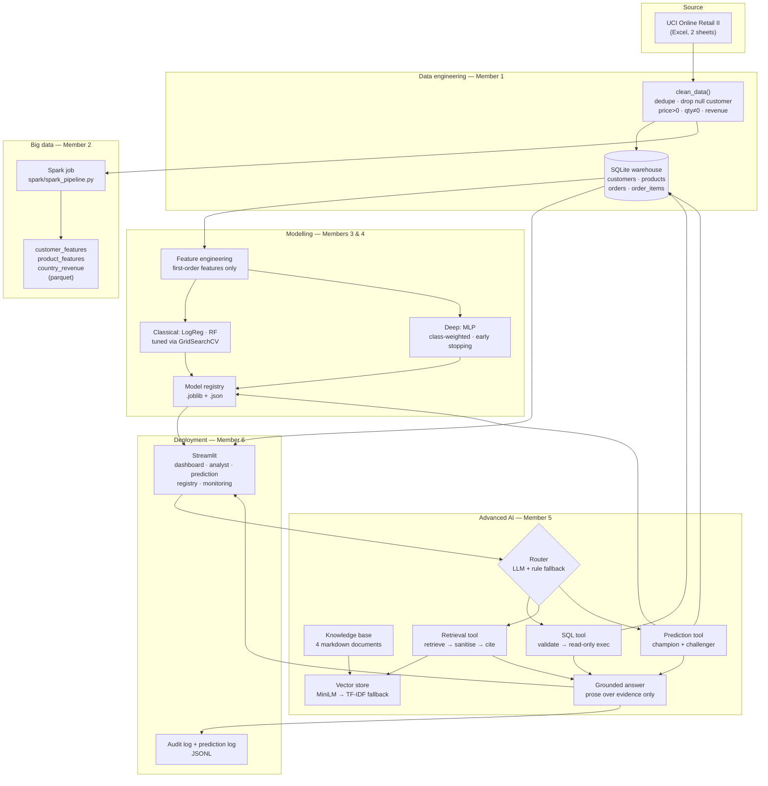
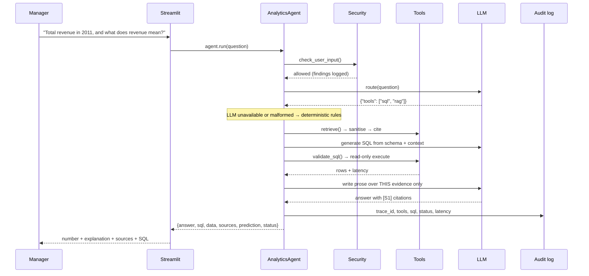
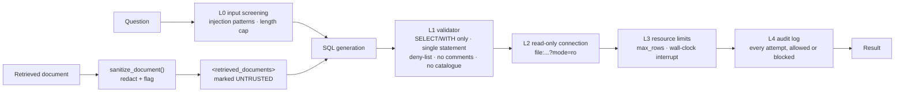

# System Architecture

## 1. End-to-end flow

## 2. Request path for one question

## 3. Guardrail stack

No single layer is trusted. L1 is a syntactic filter that a novel paraphrase
could in principle slip past; L2 is the guarantee — the process holds no write
handle to the database at all.

## 4. Component ownership

| Layer | Component | Owner |
|---|---|---|
| Ingestion, cleaning, warehouse, analytical SQL | `src/data/`, `sql/`, notebooks 01–02 | Member 1 |
| Scalable transformation | `spark/spark_pipeline.py`, notebook 03 | Member 2 |
| Classical ML | `src/features/`, `src/models/train.py`, notebook 04 | Member 3 |
| Deep learning | `src/models/dl.py`, notebook 05 | Member 4 |
| RAG, agent, guardrails, evaluation | `rag/`, `docs/security_guardrails.md`, notebook 06 | Member 5 |
| Streamlit app, MLOps, logging, Docker | `app/`, `src/utils/logger.py`, `Dockerfile` | Member 6 |

## 5. Key design decisions

| Decision | Alternative rejected | Why |
|---|---|---|
| LLM never emits a final number | Let the model answer from context | A fabricated revenue figure is the one failure a manager cannot detect. Numbers come from SQL or a model artifact; the LLM only narrates them. |
| Deterministic rule fallback for routing and SQL | LLM-only agent | The demo, the tests and the Docker image must work with no API key. The system degrades to templates rather than failing. |
| NumPy cosine index, TF-IDF fallback | FAISS / Chroma / pgvector | The knowledge base is ~50 chunks. A vector service would add a container and a download for no retrieval benefit; `Retriever` hides the store so it can be swapped later. |
| Champion/challenger served together | Ship only the better model | Both tracks are compared on every live prediction, and disagreement is surfaced in the UI rather than buried in a notebook. |
| Read-only SQLite URI | Application-level checks only | Defence in depth: a validator bug cannot become data loss. |
| Markdown-header-aware chunking | Fixed-size windows | Every chunk is one concept, so citations point at a definition instead of a page. |
